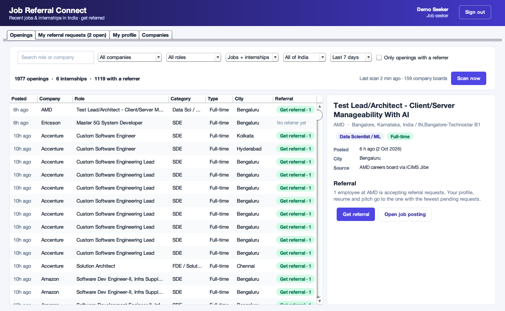
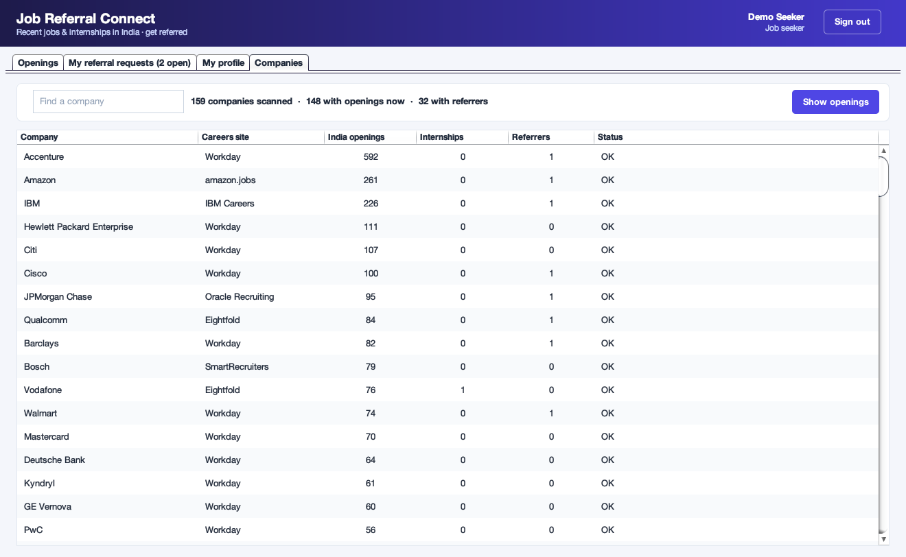
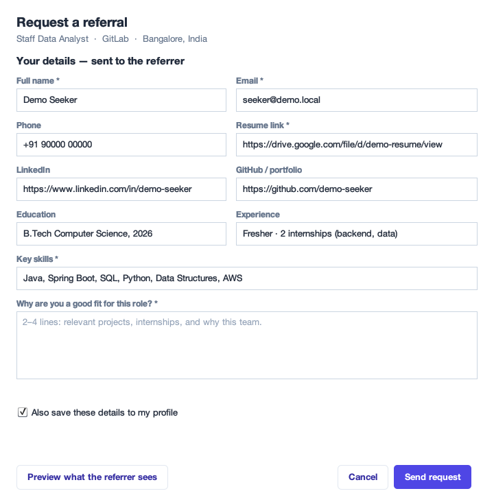
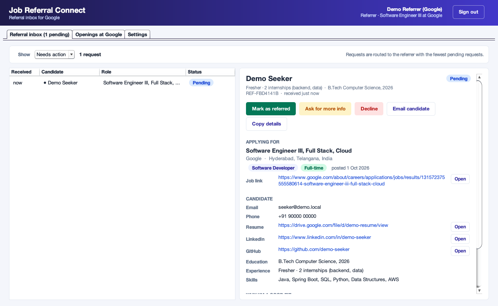
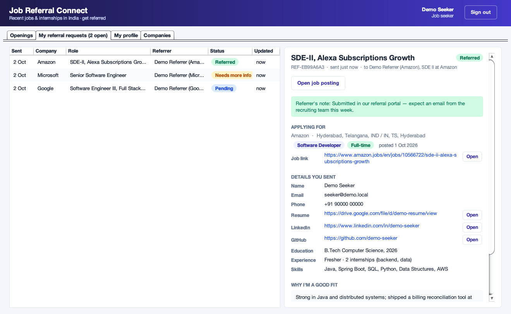

# Job Referral Connect

A desktop app that **scans the careers sites of 159 MNCs and tech companies that hire in India —
Google, Microsoft, Amazon, Apple, Qualcomm, NVIDIA, AMD, Intel, Texas Instruments, Synopsys, IBM,
Walmart, JPMorgan, Visa and many more — for recently posted jobs and internships in India**
(Software Developer, Data Analyst, Data Scientist / ML,
Data Engineer, Forward Deployed Engineer and similar roles), and lets a job seeker **request a
referral** from an employee at that company in one click. The referrer receives the candidate's full
details — resume, LinkedIn, GitHub, skills and a short pitch — and marks the request *Referred*,
*Needs more info* or *Declined*. The seeker sees every update.

**100% Java.** No frameworks, no build tool, no third-party libraries — just the JDK (Swing for the UI,
`java.net.http` for scanning, `javax.crypto` for password hashing). It includes its own small JSON
parser and test runner.



---

## How it works

```
  Google · Apple · Amazon · IBM ─┐
  Workday (NVIDIA, Walmart,      │
    Intel, Cisco, Visa, Citi …)  │
  Eightfold (Microsoft,          │
    Qualcomm, Morgan Stanley …)  ├──► JobScanner ──► keep: in India + target role + posted ≤ 30 days
  Oracle (JPMorgan, TI, Ford)    │    (159 companies,        │
  Jibe (AMD) · Radancy (Synopsys,│     in parallel)           ▼
    Arm, NetApp, Moody's)        │              Openings table ── "Get referral" ──► ReferralService
  SmartRecruiters · Greenhouse/  │              (job seeker)                           │ routes to the referrer
    Lever/Ashby ─────────────────┘
                                                                                       │ at that company with the
                                                                                       ▼ fewest pending requests
                                                                          Referrer inbox (referral packet)
                                                                                       │
                                                               Referred / Needs more info / Declined
                                                                                       │
                                                                          Seeker's "My referral requests"
```

### 1. Scanning recent openings

Each company's careers site is read through the same JSON its own careers page loads — no logins,
no API keys, nothing from LinkedIn or Naukri:

| Platform | Companies |
| --- | --- |
| Own careers sites | **Google**, **Apple**, **Amazon**, **IBM** |
| Eightfold | **Microsoft**, **Qualcomm**, Morgan Stanley, Ericsson, Vodafone, Netflix, Bayer |
| Oracle Recruiting | **JPMorgan Chase**, **Texas Instruments**, Ford |
| iCIMS Jibe | **AMD** |
| Radancy | **Synopsys**, **Arm**, NetApp, Moody's |
| Workday — tech & semiconductors | **NVIDIA**, **Intel**, **Cisco**, **Salesforce**, **Adobe**, Marvell, Microchip, Micron, Broadcom, Analog Devices, NXP Semiconductors, Cadence, Applied Materials, KLA, Samsung, Hitachi, HP, Hewlett Packard Enterprise, Autodesk, PTC, Workday, Red Hat, Zoom, CrowdStrike, Equinix, Kyndryl, Ciena, Motorola Solutions, Harman, Aptiv, Comcast, Warner Bros. Discovery, Thomson Reuters, RELX, Wolters Kluwer, Gartner |
| Workday — banks, payments & finance | **Citi**, **Wells Fargo**, **Barclays**, **Visa**, **Mastercard**, **PayPal**, Deutsche Bank, State Street, Northern Trust, BlackRock, Fidelity Investments, Ameriprise Financial, Synchrony, FIS, Fiserv, Broadridge, Morningstar, S&P Global, Nasdaq, LSEG, Amex GBT |
| Workday — retail, consulting & industry | **Walmart**, **Accenture**, Target, Lowe's, Nike, Expedia Group, FedEx, PwC, Boeing, General Motors, Caterpillar, GE Aerospace, GE Vernova, GE HealthCare, ABB, Johnson Controls, Carrier, Otis, 3M, Philips, Shell, BP |
| Workday — pharma & healthcare | Eli Lilly, Johnson & Johnson, Abbott, Bristol Myers Squibb, MSD, Pfizer, Novartis, AstraZeneca, GSK, Sanofi, Takeda, Roche, Amgen, Medtronic |
| SmartRecruiters | Bosch, ServiceNow, NielsenIQ, Freshworks, Experian, Continental, Canva |
| Greenhouse / Lever / Ashby | Stripe, Databricks, MongoDB, Okta, Zscaler, GitLab, Airbnb, Coinbase, Datadog, Elastic, Pure Storage, Rubrik, Netskope, Razorpay, Paytm, Meesho, CRED, Notion, OpenAI, Anthropic, Sarvam AI, Atlan and 18 more |

The **Companies** tab lists every company with its current India openings, internships, referrers and
whether its careers site could be read; double-click one to see its openings.



- Every platform asks for **India only** where it can (Workday's country filter, Amazon's country
  code, Eightfold's location search, …). Workday sites name that filter differently for every company,
  so the app discovers it from the site itself.
- Postings are then kept only if they are:
  - **in India** — Bengaluru, Hyderabad, Pune, Mumbai, Delhi NCR, Chennai, Kolkata, Ahmedabad, other
    Indian cities, or remote-India (without mistaking *Indiana* or *Indianapolis* for India);
  - **a target role** — titles are classified into Software Developer, Data Analyst, Data Scientist /
    ML, Data Engineer and FDE / Solutions. Managers, recruiters, sales, and chip/hardware/plant
    engineering are dropped. An "AI" in a list of skills ("Software Engineer – Java, React, AI") does
    not turn a software job into a data-science one;
  - **recent** — published in the last 30 days (filterable down to the last 24 hours).
- Synopsys, Arm and NetApp never publish posting dates. For them the app records **when it first saw
  each job** and labels it as such ("~2d ago", "first seen 2 days ago") instead of inventing a date;
  on the very first scan all their current openings therefore show as first seen today. Jobs with real
  posting dates are always listed above first-seen ones, so this never buries genuinely new openings.
- Internships are detected from the title (`intern`, `internship`, `co-op`, `apprentice`, …) and from
  each platform's own employment-type field.
- A full scan reads ~25,000 postings and finds ~4,000 matching openings. **Results appear while the scan
  runs**: each company's openings are shown as soon as it has been read, so the list fills in within
  seconds while slower sites (Microsoft and Qualcomm return 10 jobs per request) finish in the
  background. Scans repeat automatically when results are older than 30 minutes.
- Politeness and resilience: at most 16 requests in flight, rate-limit replies are retried with
  back-off, Eightfold sites (which share a rate limit) are throttled together, each company gets a
  75-second budget (a slow or throttling site keeps what it returned so far instead of holding up the
  scan), and a company that can't be read at all keeps its previous openings instead of vanishing.
- A referrer whose company isn't listed can add it by pasting its careers link (Workday, Greenhouse,
  Lever, Ashby or SmartRecruiters); it is checked once before it is accepted.
- Finding a company's Workday site took some digging: companies move between Workday server pools
  (Walmart is on `wd504`, Eli Lilly and Comcast on `wd115`, Takeda on `wd502`), and a few use the shared
  `myworkdaysite.com` host (Wells Fargo, Microchip). Each board in the directory was checked live.

### 2. Requesting a referral (job seeker)

Each opening shows whether anyone at that company has signed up as a referrer. **Get referral** opens
a form pre-filled from the seeker's profile:



Rules that keep the system useful for referrers:

| Rule | Why |
| --- | --- |
| Resume link, skills and education/experience are required | A referrer cannot refer without them |
| Pitch of at least 30 characters | It's the one thing a resume doesn't say |
| One live request per job | No duplicates |
| At most 3 open requests per company | No flooding one company's referrers |
| Routed to the referrer with the **fewest pending requests** | Spreads the load |
| A referrer who declined you for a job is never asked again for it | Retry goes to someone else |

### 3. Acting on it (referrer)

The referrer's inbox shows each request as a **referral packet**: candidate, contact details,
resume / LinkedIn / GitHub links, the job, the pitch and a timeline.



- **Mark as referred** (optional note, e.g. "Submitted in our portal")
- **Ask for more info** (required note) — the seeker updates their details and resubmits
- **Decline** (required reason, so the candidate can improve)
- **Email candidate** opens the referrer's mail app, **Copy details** puts the packet on the clipboard
  for pasting into the company's internal referral form
- Referrers can pause new requests from **Settings**

```
PENDING ──► REFERRED
   │  ╲──► DECLINED
   │   ╲─► NEEDS_INFO ──► PENDING   (seeker resubmits)
   └─────► WITHDRAWN               (seeker cancels; also from NEEDS_INFO)
```

The seeker tracks everything under **My referral requests**:



---

## Running it

Requires **Java 21 or newer** (`java -version`).

```bash
git clone https://github.com/chauhansachin13/job-referral-connect.git
cd job-referral-connect
javac -d out --source-path src/main/java src/main/java/com/referralconnect/Main.java
java -cp out com.referralconnect.Main --demo
```

`--demo` adds sample accounts so you can try both sides straight away (password `demo1234`):

| Role | Email |
| --- | --- |
| Job seeker | `seeker@demo.local` |
| Referrer at Google, Microsoft, Amazon, Apple, NVIDIA, Adobe, Salesforce, Intel, Cisco, Qualcomm, JPMorgan Chase, Accenture, Walmart, AMD, IBM, Texas Instruments, Synopsys, Visa, Wells Fargo, Barclays, MongoDB, Okta, Zscaler, GitLab, Stripe, Databricks, Pure Storage, Rubrik, Notion, Paytm, Netskope, Celonis | `referrer.<company>@demo.local` — lower-case, letters and digits only, e.g. `referrer.google@demo.local`, `referrer.jpmorganchase@demo.local` |

**See both sides live:** start the app twice. Sign in as the seeker in one window and as, say, the
Google referrer in the other. Request a referral for a Google job and it appears in the referrer's
inbox within a few seconds; act on it and the seeker's window updates.

Other options:

```bash
java -cp out com.referralconnect.Main                       # normal start (no demo accounts)
java -cp out com.referralconnect.Main --scan                # scan and print openings in the terminal
java -cp out com.referralconnect.Main --home /path/folder   # keep data somewhere else
```

On Java 22+ you can also skip `javac` entirely: `java src/main/java/com/referralconnect/Main.java --demo`.

To share it as a single double-clickable file, package a runnable JAR with the JDK's own `jar` tool:

```bash
jar --create --file job-referral-connect.jar --main-class com.referralconnect.Main -C out .
java -jar job-referral-connect.jar --demo
```

### Tests

```bash
javac -d out-test --source-path src/main/java:src/test/java src/test/java/com/referralconnect/TestRunner.java
java -cp out-test com.referralconnect.TestRunner
```

71 tests cover the JSON parser, role and India classification, every careers-platform adapter
(against recorded-shape responses, so they run offline), the scanner, password hashing, the data store
(persistence, two windows writing at once, rollback, damaged files), sign-up/sign-in, and every
referral rule and status transition.

---

## Where data lives

Everything is stored in one readable JSON file: `~/.job-referral-connect/data.json` (override with
`--home`, `-Dreferralconnect.home=…` or `REFERRALCONNECT_HOME`). Every write takes an OS file lock,
re-reads the file and replaces it atomically, so several app windows — or several machines pointing
`--home` at a shared folder — can use it at the same time without overwriting each other. Passwords
are stored as salted PBKDF2-SHA256 hashes.

## Project layout

```
src/main/java/com/referralconnect/
├── Main.java                 entry point (GUI, --demo, --scan, --home)
├── json/Json.java            minimal JSON parser/writer
├── model/                    Account, CandidateProfile, JobPosting, ReferralRequest, RequestStatus, …
├── scan/                     JobScanner, RoleClassifier, IndiaLocations, BoardUrlParser, Http
│   └── source/               one adapter per careers platform: Workday, Eightfold, Oracle, Jibe,
│                             Radancy, SmartRecruiters, Amazon, Apple, Google, IBM, Greenhouse/Lever/Ashby
├── store/DataStore.java      file-locked JSON persistence
├── service/                  AuthService, JobService, ReferralService, CompanyDirectory, DemoData
└── ui/                       Swing screens: sign-in, seeker dashboard, referrer inbox, dialogs
src/test/java/com/referralconnect/
└── TestRunner.java + *Test.java
```

## Limitations

- **Some big employers can't be included.** MediaTek's careers system (eREC at careers.mediatek.com)
  doesn't expose a public job list this app could find; its India openings appear on LinkedIn, which
  the app deliberately doesn't read. Meta, Dell, Honeywell, HSBC, UBS,
  American Express, Goldman Sachs, Uber, SAP, Nokia, Western Digital, Palo Alto Networks and the large
  Indian IT services firms either don't publish a readable jobs feed or use one this app doesn't
  support; none of them answered on any of 40 Workday server pools.
- **Apple and Google have no JSON API**; their jobs are read from the data embedded in their public
  search pages, and Radancy sites (Synopsys, Arm, NetApp, Moody's) return HTML fragments. If a company
  redesigns its page, it shows as unreachable in the Companies tab until the adapter is updated (the
  rest of the scan is unaffected).
- Very large boards are capped per scan (Workday at 1,000 India postings, Amazon at the newest 1,500,
  Eightfold at the newest 250), so a few of the oldest openings at those companies may be missed.
- Referrers' employment is not verified; anyone can sign up as a referrer for any listed company.
- Notifications are in-app (and via the referrer's own mail app); the app does not send email itself.
