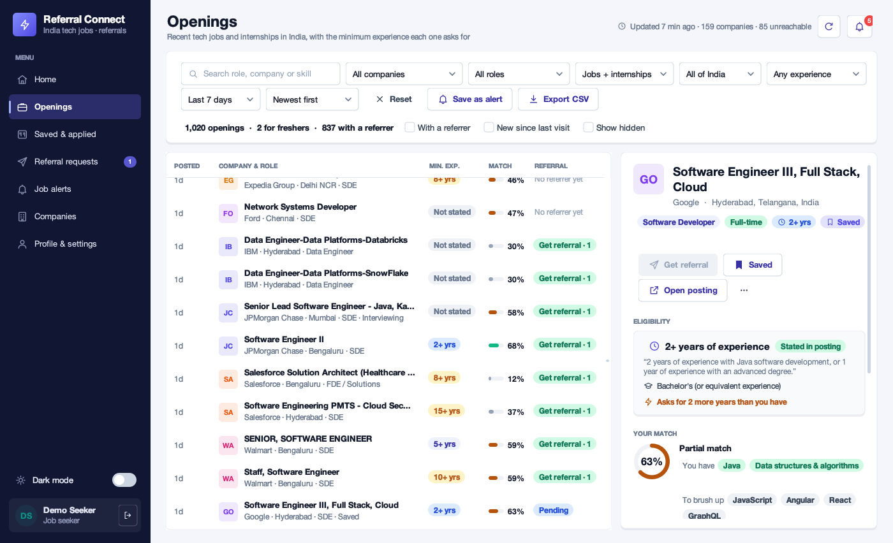
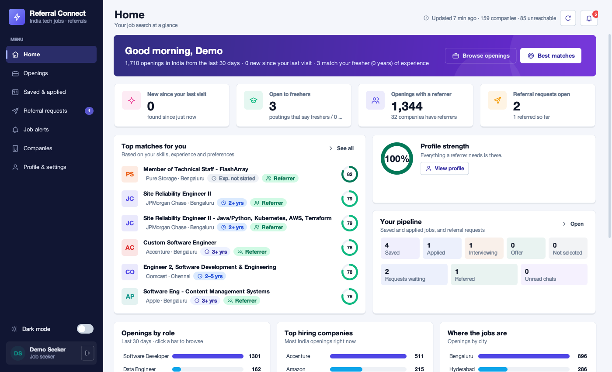
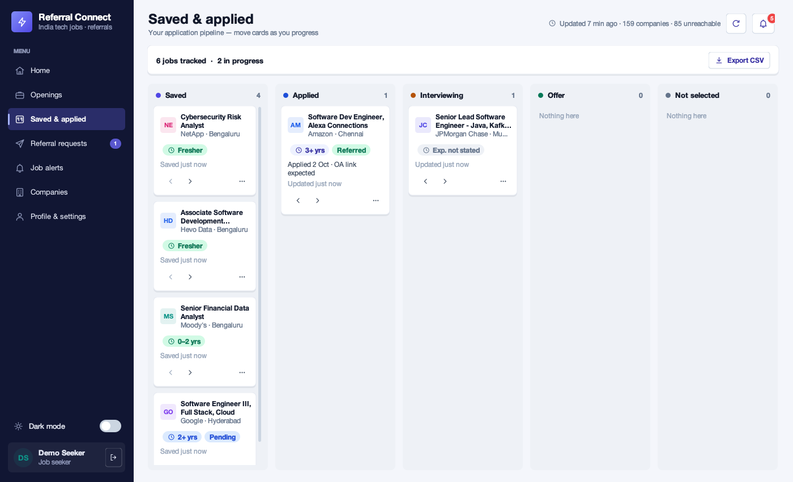
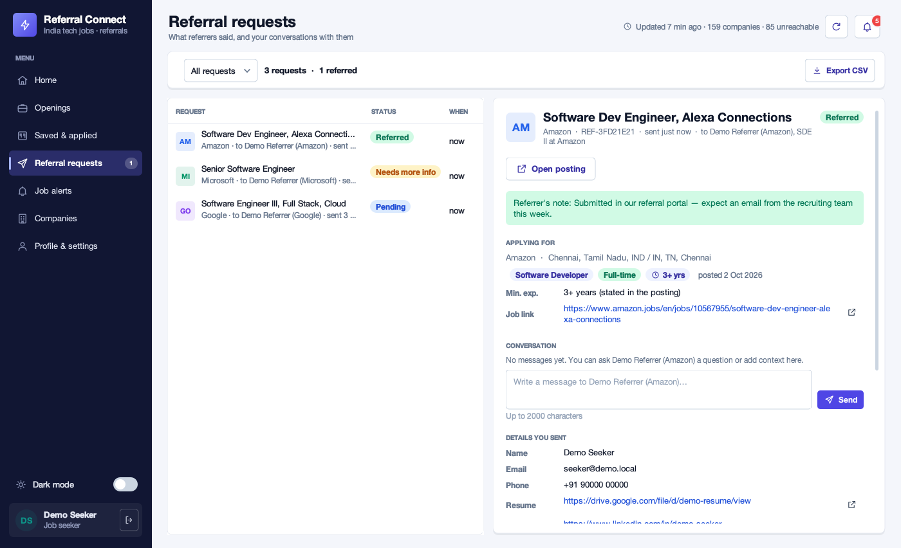
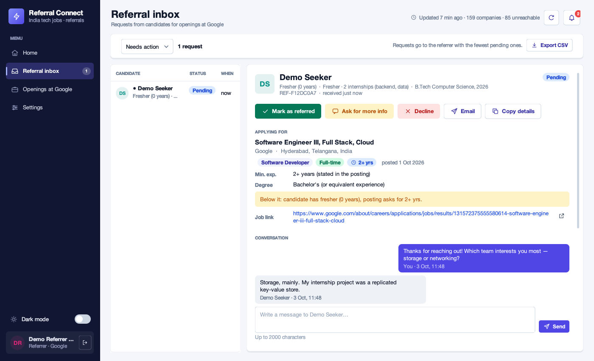
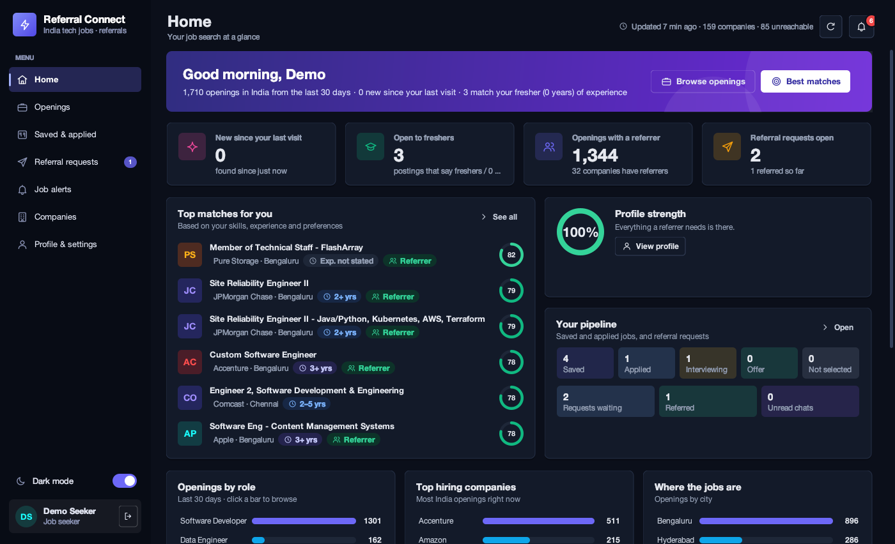
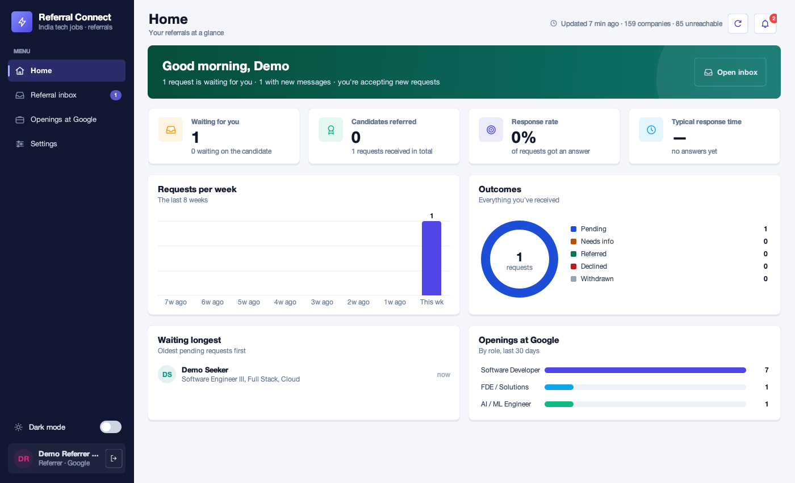
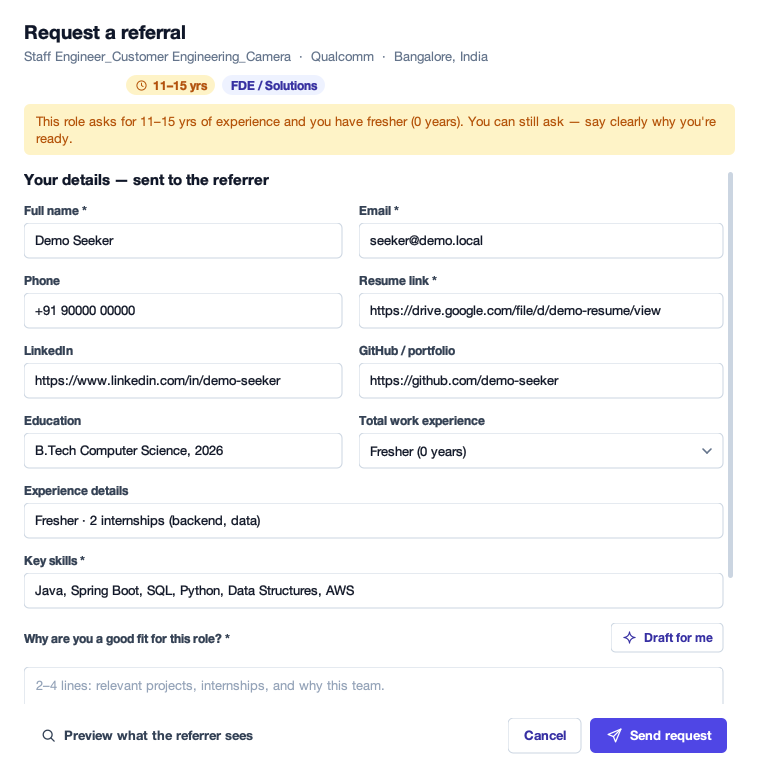

# Job Referral Connect

A desktop app that **scans the careers sites of 159 MNCs and tech companies that hire in India —
Google, Microsoft, Amazon, Apple, Qualcomm, NVIDIA, AMD, Intel, Texas Instruments, Synopsys, IBM,
Walmart, JPMorgan, Visa and many more — for recently posted jobs and internships in India** in
**computer-science roles only** (software engineering, data science, AI / ML, data engineering,
data / BI analysis and forward-deployed / solutions engineering), shows the **minimum experience and
eligibility each posting asks for**, scores how well every opening **matches your profile**, and lets
you **request a referral** from an employee at that company in one click. The referrer receives your
full details — resume, LinkedIn, GitHub, skills, years of experience and a short pitch — can **chat
with you**, and marks the request *Referred*, *Needs more info* or *Declined*. You see every update.

**100% Java.** No frameworks, no build tool, no third-party libraries — just the JDK (Swing for the UI,
`java.net.http` for scanning, `javax.crypto` for password hashing). It includes its own small JSON
parser, test runner, vector icons, charts and a light / dark theme.



---

## What you can do

**As a job seeker**

| | |
| --- | --- |
| **Home dashboard** | What's new since your last visit, fresher-friendly openings, openings with a referrer, your top matches, profile strength, your pipeline, and charts of openings by role, company and city |
| **Openings** | Every recent India opening with its **minimum experience**, a **match score** and whether a referrer is available. Filter by company, role, type, city, **experience** ("Freshers (0 years)", "Up to 2 years", "Fits my experience", …), posting window, "new since last visit" and "with a referrer"; sort by newest, **best match**, **least experience** or company |
| **Eligibility** | For each opening: the minimum years exactly as the posting states them (with the sentence they came from, or "Not stated" — never a guess), the degree, the graduating batch, the skills it mentions, and whether *you* meet it |
| **Get referral** | One click sends your profile and pitch to an employee there; **"Draft for me"** writes a first pitch from your profile and the posting's skills |
| **Saved & applied** | A board to track applications: Saved → Applied → Interviewing → Offer / Not selected, with notes |
| **Referral requests** | Status, the referrer's notes, a **chat thread** with the referrer, **update & resubmit**, a polite **reminder** after 3 quiet days, withdraw |
| **Job alerts** | Save any filter as an alert; after every scan new matches are counted and you're notified |
| **Notifications** | A bell with everything that happened: referrals, questions, messages, reminders, alert matches |
| **Also** | Hide openings you're not interested in, export openings / requests / applications to **CSV**, dark mode, auto-scan every 30 minutes, keyboard shortcuts |

**As a referrer**

| | |
| --- | --- |
| **Home** | Requests waiting, candidates referred, response rate, typical response time, requests per week, outcomes, and who has waited longest |
| **Inbox** | Each request as a referral packet — including whether the candidate meets the job's minimum experience — with a chat thread, **quick-reply templates**, *Mark as referred* / *Ask for more info* / *Decline*, email and copy-to-clipboard |
| **Openings at your company** | What candidates can ask you to refer them for, with each role's minimum experience |
| **Settings** | Your role, pausing new requests, dark mode, auto-scan |

| Home | Saved & applied |
| --- | --- |
|  |  |
| **Referral requests with chat** | **Referrer inbox** |
|  |  |
| **Dark mode** | **Referrer home** |
|  |  |

---

## How it works

```
  Google · Apple · Amazon · IBM ─┐
  Workday (NVIDIA, Walmart,      │
    Intel, Cisco, Visa, Citi …)  │
  Eightfold (Microsoft,          │                       ┌─► minimum experience, degree,
    Qualcomm, Morgan Stanley …)  ├──► JobScanner ────────┤    batch, skills (from each
  Oracle (JPMorgan, TI, Ford)    │    keep: India +      │    posting's description)
  Jibe (AMD) · Radancy (Synopsys,│    CSE role + ≤ 30 d  └─► match score vs. your profile
    Arm, NetApp, Moody's)        │              │
  SmartRecruiters · Greenhouse/  │              ▼
    Lever/Ashby ─────────────────┘   Openings ── "Get referral" ──► ReferralService
                                     (job seeker)                     │ routes to the referrer at that
                                                                      ▼ company with the fewest pending
                                                          Referrer inbox (packet + chat)
                                                                      │
                                                Referred / Needs more info / Declined
                                                                      │
                                                   Seeker's requests, bell and dashboard
```

### 1. Scanning recent openings

Each company's careers site is read through the same JSON its own careers page loads — no logins,
no API keys, nothing from LinkedIn or Naukri:

| Platform | Companies |
| --- | --- |
| Own careers sites | **Google**, **Apple**, **Amazon**, **IBM** |
| Eightfold | **Microsoft**, **Qualcomm**, Morgan Stanley, Ericsson, Vodafone, Netflix, Bayer |
| Oracle Recruiting | **JPMorgan Chase**, **Texas Instruments**, Ford |
| iCIMS Jibe | **AMD** |
| Radancy | **Synopsys**, **Arm**, NetApp, Moody's |
| Workday — tech & semiconductors | **NVIDIA**, **Intel**, **Cisco**, **Salesforce**, **Adobe**, Marvell, Microchip, Micron, Broadcom, Analog Devices, NXP Semiconductors, Cadence, Applied Materials, KLA, Samsung, Hitachi, HP, Hewlett Packard Enterprise, Autodesk, PTC, Workday, Red Hat, Zoom, CrowdStrike, Equinix, Kyndryl, Ciena, Motorola Solutions, Harman, Aptiv, Comcast, Warner Bros. Discovery, Thomson Reuters, RELX, Wolters Kluwer, Gartner |
| Workday — banks, payments & finance | **Citi**, **Wells Fargo**, **Barclays**, **Visa**, **Mastercard**, **PayPal**, Deutsche Bank, State Street, Northern Trust, BlackRock, Fidelity Investments, Ameriprise Financial, Synchrony, FIS, Fiserv, Broadridge, Morningstar, S&P Global, Nasdaq, LSEG, Amex GBT |
| Workday — retail, consulting & industry | **Walmart**, **Accenture**, Target, Lowe's, Nike, Expedia Group, FedEx, PwC, Boeing, General Motors, Caterpillar, GE Aerospace, GE Vernova, GE HealthCare, ABB, Johnson Controls, Carrier, Otis, 3M, Philips, Shell, BP |
| Workday — pharma & healthcare | Eli Lilly, Johnson & Johnson, Abbott, Bristol Myers Squibb, MSD, Pfizer, Novartis, AstraZeneca, GSK, Sanofi, Takeda, Roche, Amgen, Medtronic |
| SmartRecruiters | Bosch, ServiceNow, NielsenIQ, Freshworks, Experian, Continental, Canva |
| Greenhouse / Lever / Ashby | Stripe, Databricks, MongoDB, Okta, Zscaler, GitLab, Airbnb, Coinbase, Datadog, Elastic, Pure Storage, Rubrik, Netskope, Razorpay, Paytm, Meesho, CRED, Notion, OpenAI, Anthropic, Sarvam AI, Atlan and 18 more |

The **Companies** page lists every company with its current India openings, internships, referrers and
whether its careers site could be read; double-click one to see its openings.

- Every platform asks for **India only** where it can (Workday's country filter, Amazon's country
  code, Eightfold's location search, …). Workday sites name that filter differently for every company,
  so the app discovers it from the site itself.
- Postings are then kept only if they are:
  - **in India** — Bengaluru, Hyderabad, Pune, Mumbai, Delhi NCR, Chennai, Kolkata, Ahmedabad, other
    Indian cities, or remote-India (without mistaking *Indiana* or *Indianapolis* for India);
  - **a computer-science role** — titles are classified into Software Developer (including SRE,
    DevOps, cloud, QA/SDET, security and embedded software), Data Scientist, AI / ML Engineer, Data
    Engineer, Data Analyst (data and BI analysts only) and FDE / Solutions (forward-deployed engineers,
    solutions engineers and architects). A title has to say what kind of computing work it is: a bare
    "Engineer II" only counts at software companies, because at banks, chip makers and industrial
    firms it usually means mechanical, electrical, chip or plant engineering. Business, finance and
    risk analysts, support and service engineers, consultants, managers, recruiters, representatives
    and sales roles are dropped;
  - **recent** — published in the last 30 days (filterable down to the last 24 hours).
- Synopsys, Arm and NetApp never publish posting dates. For them the app records **when it first saw
  each job** and labels it as such ("~2d", "first seen 2 days ago") instead of inventing a date.
  Jobs with real posting dates are always listed above first-seen ones.
- A full scan reads ~25,000 postings and finds ~3,200 matching openings. **Results appear while the
  scan runs**: each company's openings are shown as soon as it has been read. With auto-scan on,
  results refresh every 30 minutes while the app is open.
- Politeness and resilience: at most 16 requests in flight, rate-limit replies are retried with
  back-off, Eightfold sites (which share a rate limit) are throttled together, each company gets a
  75-second budget for its listing and 40 seconds for descriptions, and a company that can't be read
  keeps its previous openings instead of vanishing.
- A referrer whose company isn't listed can add it by pasting its careers link (Workday, Greenhouse,
  Lever, Ashby or SmartRecruiters); it is checked once before it is accepted.

### 2. Minimum experience and eligibility

For every opening the app reads the posting's **description or qualifications** and shows only what
the posting itself states — **nothing is guessed**:

- **Minimum years of experience** from the required qualifications, in the posting's own figures —
  "Minimum 3 year(s) of experience is required" → 3+, "Years of experience required: 4 – 7 Years" →
  4–7, "Minimum 7.5 year(s)" → 7.5+, "0.6 to 3 years" → 0.6–3, "2+ yrs", "at least two (2) years",
  "five to eight years", "freshers welcome". The figure may sit on the line after its label, be
  written "10Yrs to 13Yrs" or "4 ~10 years", or be buried in one long run-on paragraph.
- When several figures are given, the overall one counts ("8+ years, including 3+ with Kafka" needs
  8), and for postings that offer routes by degree ("Bachelor's and 5 years, or Master's and 3
  years") the Bachelor's route is shown.
- **Preferred** and *nice-to-have* lines never become the minimum. If a posting gives years *only* as
  a preference, that is shown as "Pref. 5+ yrs" and labelled as preferred, not required.
- Company history ("for more than 25 years"), tenure ("average length of service of 9 years"),
  schooling ("15 years full time education"), ages, benefits and career breaks don't count.
- If the posting states no years, it shows **Not stated**. If its description hasn't been fetched yet
  (a big board is read over a few scans), it shows **Not read yet** instead — the app never claims a
  posting is silent before reading it. Job levels such as "Senior", "Associate" or "Intern" are never
  turned into a number, and openings without a stated figure are left out of the experience filters
  rather than guessed into them. The sentence each figure came from is always quoted next to it.
- The **degree** ("Bachelor's in Computer Science or a related field (or equivalent experience)"),
  the **graduating batch** ("2025, 2026") and the **skills** the posting names (Java, Spring, AWS,
  Kubernetes, SQL, PyTorch, … — about 90 technologies).

**How accurate it is.** The reader was built against 588 real postings from the supported careers
sites, then checked by hand on 192 postings it had never seen: every figure it showed was compared
with the posting's text, and every posting it marked "Not stated" was searched for any number of
years it might have missed. That check found 7 wrong figures — for example "4 ~10 years" read as
10+, and a company's "average length of service of 9 years" read as a requirement. Those wordings
are now handled and covered by tests. The 27 postings it marks "Not stated" really state no years.

Where the descriptions come from: Amazon, Google, Lever, Ashby, AMD (Jibe) and IBM include them in
their listings; for Workday, Eightfold, Oracle, Greenhouse, SmartRecruiters, Apple and Radancy the app
fetches each matching job's description once, newest first, and remembers what it read, so later scans
only read new jobs.

Your **match score** (0–100%) combines your skills with the posting's (its first-listed, core skills
count most), your years of experience against its minimum, and the roles and cities you picked in your
preferences.



### 3. Requesting a referral (job seeker)

**Get referral** opens a form pre-filled from your profile. Rules that keep the system useful for
referrers:

| Rule | Why |
| --- | --- |
| Resume link, skills and education/experience are required | A referrer cannot refer without them |
| Pitch of at least 30 characters | It's the one thing a resume doesn't say |
| One live request per job | No duplicates |
| At most 3 open requests per company | No flooding one company's referrers |
| Routed to the referrer with the **fewest pending requests** | Spreads the load |
| A referrer who declined you for a job is never asked again for it | Retry goes to someone else |
| A reminder only after 3 days without any activity, once per quiet spell | Polite nudges, no spam |

### 4. Acting on it (referrer)

- **Mark as referred** (optional note) · **Ask for more info** (required note — the seeker updates their
  details and resubmits) · **Decline** (required reason, so the candidate can improve). Each comes with
  quick-reply templates.
- **Messages** on the request reach the other side as notifications.
- **Email** opens the referrer's mail app; **Copy details** puts the packet on the clipboard for the
  company's internal referral form.
- Referrers can pause new requests from **Settings**.

```
PENDING ──► REFERRED
   │  ╲──► DECLINED
   │   ╲─► NEEDS_INFO ──► PENDING   (seeker resubmits)
   └─────► WITHDRAWN               (seeker cancels; also from NEEDS_INFO)
```

---

## Running it

Requires **Java 21 or newer** (`java -version`).

```bash
git clone https://github.com/chauhansachin13/job-referral-connect.git
cd job-referral-connect
javac -d out --source-path src/main/java src/main/java/com/referralconnect/Main.java
java -cp out com.referralconnect.Main --demo
```

`--demo` adds sample accounts so you can try both sides straight away; the sign-in screen then offers
one-click "As a job seeker" / "As a Google referrer" buttons (password `demo1234`):

| Role | Email |
| --- | --- |
| Job seeker | `seeker@demo.local` |
| Referrer at Google, Microsoft, Amazon, Apple, NVIDIA, Adobe, Salesforce, Intel, Cisco, Qualcomm, JPMorgan Chase, Accenture, Walmart, AMD, IBM, Texas Instruments, Synopsys, Visa, Wells Fargo, Barclays, MongoDB, Okta, Zscaler, GitLab, Stripe, Databricks, Pure Storage, Rubrik, Notion, Paytm, Netskope, Celonis | `referrer.<company>@demo.local` — lower-case, letters and digits only, e.g. `referrer.google@demo.local`, `referrer.jpmorganchase@demo.local` |

**See both sides live:** start the app twice. Sign in as the seeker in one window and as, say, the
Google referrer in the other. Request a referral for a Google job and it appears in the referrer's
inbox within a few seconds; reply or act on it and the seeker's window updates.

Keyboard shortcuts (⌘ on macOS, Ctrl elsewhere): **⌘1–⌘7** switch pages, **⌘F** search openings,
**⌘R** scan now, **⌘D** dark mode, **⇧⌘N** notifications, **⌘Enter** send a message.

Other options:

```bash
java -cp out com.referralconnect.Main                       # normal start (no demo accounts)
java -cp out com.referralconnect.Main --scan                # scan and print openings (with minimum experience)
java -cp out com.referralconnect.Main --home /path/folder   # keep data somewhere else
```

On Java 22+ you can also skip `javac` entirely: `java src/main/java/com/referralconnect/Main.java --demo`.

To share it as a single double-clickable file, package a runnable JAR with the JDK's own `jar` tool:

```bash
jar --create --file job-referral-connect.jar --main-class com.referralconnect.Main -C out .
java -jar job-referral-connect.jar --demo
```

### Tests

```bash
javac -d out-test --source-path src/main/java:src/test/java src/test/java/com/referralconnect/TestRunner.java
java -cp out-test com.referralconnect.TestRunner
```

98 tests cover the JSON parser, role and India classification, every careers-platform adapter
(against recorded-shape responses, so they run offline), reading minimum experience, degree, batch and
skills from real posting wordings (including ones an earlier version misread), the scanner (including fetching and remembering descriptions),
match scores, pitch drafts, CSV export, password hashing, the data store (persistence, two windows
writing at once, rollback, damaged files), sign-up/sign-in, every referral rule and status transition,
messages, reminders, referrer stats, notifications, saved jobs, alerts and preferences.

---

## Where data lives

Everything is stored in one readable JSON file: `~/.job-referral-connect/data.json` (override with
`--home`, `-Dreferralconnect.home=…` or `REFERRALCONNECT_HOME`). Every write takes an OS file lock,
re-reads the file and replaces it atomically, so several app windows — or several machines pointing
`--home` at a shared folder — can use it at the same time without overwriting each other. Passwords
are stored as salted PBKDF2-SHA256 hashes.

## Project layout

```
src/main/java/com/referralconnect/
├── Main.java                 entry point (GUI, --demo, --scan, --home)
├── json/Json.java            minimal JSON parser/writer
├── model/                    Account, CandidateProfile, JobPosting, Requirements, ReferralRequest,
│                             TrackedJob, JobAlert, UserPrefs, …
├── scan/                     JobScanner, RoleClassifier, RequirementsExtractor, SkillCatalog,
│   │                         IndiaLocations, BoardUrlParser, Http
│   └── source/               one adapter per careers platform: Workday, Eightfold, Oracle, Jibe,
│                             Radancy, SmartRecruiters, Amazon, Apple, Google, IBM, Greenhouse/Lever/Ashby
├── store/DataStore.java      file-locked JSON persistence
├── service/                  AuthService, JobService, ReferralService, TrackerService, AlertService,
│                             NotificationService, PrefsService, JobMatcher, PitchWriter, CsvExport, …
└── ui/                       Swing: Shell (sidebar + top bar), Home, Openings, Tracker, Requests, Alerts,
                              Companies, Profile, referrer Home and Inbox, dialogs; Theme/Laf (light & dark),
                              Icons, Charts, Toasts
src/test/java/com/referralconnect/
└── TestRunner.java + *Test.java
```

## Limitations

- **Experience is read from text**, so a posting phrased in a way not seen before can still be misread;
  the sentence each figure came from is always shown, so you can check it. Some companies (IBM, AMD,
  Barclays, LSEG) rarely state years at all, and those openings show "Not stated". A posting that
  contradicts itself (one line says 4–8 years, another 10+) shows the larger stated figure.
- **The first scan after updating takes longer**: results saved by an earlier version are discarded
  and every description is read again, so nothing old or guessed is shown.
- **Some big employers can't be included.** MediaTek's careers system (eREC at careers.mediatek.com)
  doesn't expose a public job list this app could find; its India openings appear on LinkedIn, which
  the app deliberately doesn't read. Meta, Dell, Honeywell, HSBC, UBS, American Express, Goldman
  Sachs, Uber, SAP, Nokia, Western Digital, Palo Alto Networks and the large Indian IT services firms
  either don't publish a readable jobs feed or use one this app doesn't support.
- **Apple and Google have no JSON API**; their jobs are read from the data embedded in their public
  pages, and Radancy sites return HTML. If a company redesigns its page, it shows as unreachable on the
  Companies page until the adapter is updated (the rest of the scan is unaffected).
- Very large boards are capped per scan (Workday at 1,000 India postings, Amazon at the newest 1,500,
  Eightfold at the newest 250), and descriptions are read in batches per scan (e.g. 150 per Workday
  company), so a company's first scan may show some openings without a minimum until the next scan.
- Referrers' employment is not verified; anyone can sign up as a referrer for any listed company.
- Notifications are in-app (and via the referrer's own mail app); the app does not send email itself.
